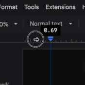

---

title: "The Digital Way: Current Affairs"
description: "This post is about current affairs from CGPSC perspective."
publishDate: "19 April 2024"
updatedDate: "19 April 2024"
coverImage:
  src: "./current-affairs.png"
  alt: "Pixel girl reading news paper."
tags: ["current-affairs"]

---
This writing is completely based on Neer Sir's [video guide](https://www.youtube.com/watch?v=QZUoyk9AMcM) on maintaining Google Docs for Current Affairs from Mains perspective.
This writing is supposed to be a time saver. If you are more into videos, I recommend skipping this writing entirely and visiting his video guide.

Keep the official syllabus issued by CGPSC nearby because you need it for this guide.

## Adding essential elements
Once you have created a new Doc start by adjusting the left margin. You need some space on the left & right side in case you want to take a print out later (changing margins later messes up page structure). Place your cursor slightly on the left of the blue Indent markers (NOT on them) and drag towards the right.

Now add these elements.
1. Page numbers `Insert > Page numbers > [desired style]`
2. Index `Insert > Table of contents > [desired style]` And then Page Break `Ctrl + ↵` or `⌘ + ↵`