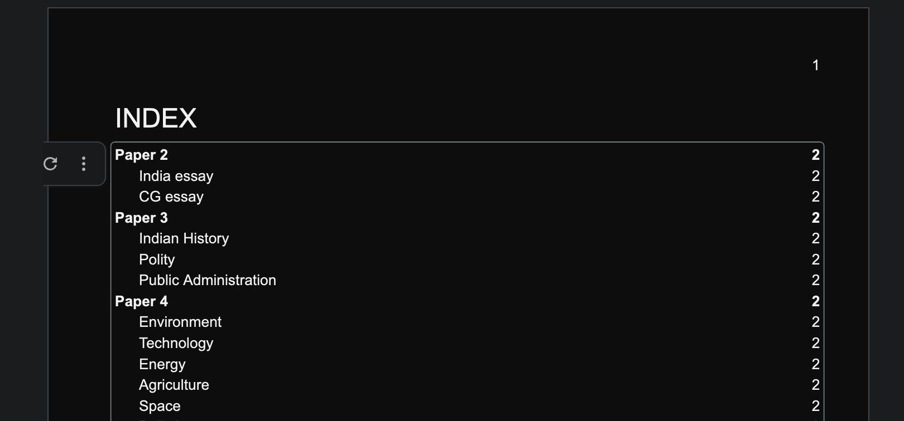
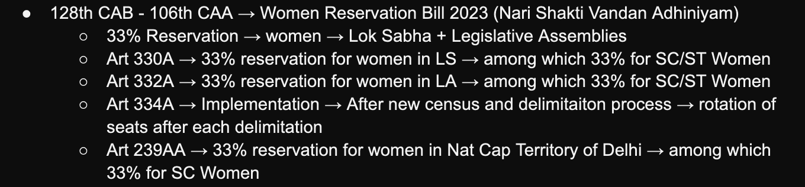

---

title: "The Digital Way: Current Affairs"
description: "This post is about current affairs from CGPSC perspective."
publishDate: "19 April 2024"
updatedDate: "20 April 2024"
coverImage:
  src: "./current-affairs.png"
  alt: "Pixel girl reading news paper."
tags: ["current-affairs"]

---
This writing is completely based on Neer Sir's [video guide](https://www.youtube.com/watch?v=QZUoyk9AMcM) on maintaining Google Docs for Current Affairs from Mains perspective.
This writing is supposed to be a time saver eliminating some manual labour. If you are more into videos, I recommend skipping this writing entirely and visiting his video guide.

Keep the official syllabus issued by CGPSC nearby because you need it for this guide.

## Adding essential elements
Once you have created a new Doc start by adjusting the left margin. You need some space on the left & right side in case you want to take a print out later (changing margins later messes up page structure). Place your cursor slightly on the left of the blue Indent markers (NOT on them) and drag towards the right.


Now add these elements.
1. Page numbers `Insert > Page numbers > [desired style]`
2. Index `Insert > Table of contents > [desired style]` And then Page Break `Ctrl + ↵` or `⌘ + ↵`

Optionally you can add your own watermark.
`Insert > Watermark > Text > [add desired text and style]`


## The structure
Now take out that syllabus document and head to the Mains syllabus.

Following the division of the syllabus, you want Papers as headings. Subjects as sub-headings of Papers. Broad Topics as sub-headings of Subjects where required.

I'll save you some time. Copy the following to your Doc and change each to adequate headings.

```
Paper 2
India essay
CG essay
Paper 3
Indian History
Polity
Public Administration
Paper 4
Environment
Technology
Energy
Agriculture
Space
Pollution
Waste Management
Paper 5
Indian Economy
CG Economy
Indian Geography
CG Geography
Paper 6
Tribes
Tourism
Culture
Schemes
Awards
Paper 7
Laws
International Organisations
Sports
HRD
```

It should look like the following. The Outline to the left should be populated now. Clicking on those jumps the cursor directly to the Heading.


Optionally you may add Page Breaks after each Topic or Paper according to the aesthetics you are going for. `Ctrl + ↵` or `⌘ + ↵`

You can click anywhere on the Index and reload to populate it.


## Populating the Doc
You really want to format your Doc for readablity.

- You can use bulleted lists
1. Or numbered lists

Or a mix of both, or any other formatting you please. The following is how I like to format mine.


- '-->' Changes to → by default.


- Hitting Tab nests lists.


To make taking notes efficient, refer to the Cheat Sheet of keyboard commands.

## Cheat Sheet
| Windows              | Mac                  | Actions           |
|----------------------|----------------------|-------------------|
| `Ctrl + Shift + 7`   | `⌘ + Shift + 7`      | Numbered list     |
| `Ctrl + Shift + 8`   | `⌘ + Shift + 8`      | Bulleted list     |
| `Ctrl + Alt + 0`     | `⌘ + Option + 0`     | Normal text style |
| `Ctrl + Alt + [1-6]` | `⌘ + Option + [1-6]` | Heading style     |